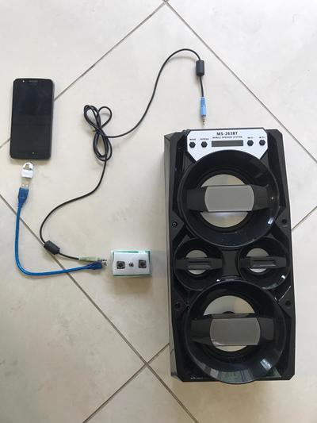
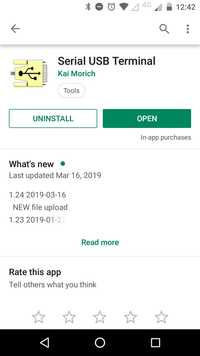
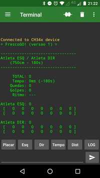
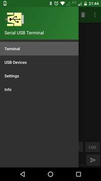
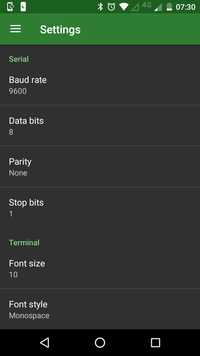
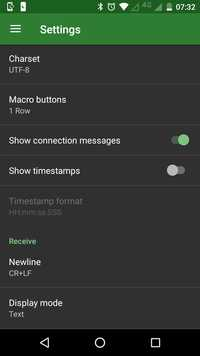
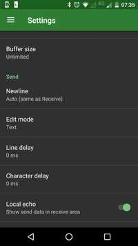
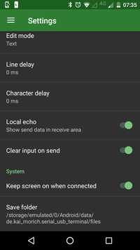

# FrescoGO! - Controle

## Fluxo da Apresentação

- Um som agudo longo indica que a uma nova apresentação irá começar.
- Um som agudo indica que o atleta pode sacar. Após 5 segundos, o tempo de
  descanso começa a acumular até que o atleta saque.
- Após o saque, o juiz pressiona o botão correspondente a cada atleta toda vez
  que ele acerta a bola. O tempo só passa quando o botão é pressionado.
- Um som identifica a faixa de velocidade do golpe anterior:
    - `até 50 kmh`: som grave
    - `até 60 kmh`: som médio
    - `até 70 kmh`: som agudo
    - `>= 80 kmh`: som duplo   médio
    - ` < 90 kmh`: som duplo   agudo
    - `>= 90 kmh`: som duplo   muito agudo
- Um golpe de revés do atleta acompanha um som grave (após o som correspondente
  à velocidade). Em seguida, caso a velocidade do revés seja validada, um som
  grave duplo acompanha o golpe seguinte do parceiro.
- Quando a apresentação está desequilibrada, os ataques do atleta que mais
  pontuou acompanham um som grave.
- Quando a bola cai, o juiz pressiona o botão de queda que emite um som
  característico.
- Os dois últimos golpes são ignorados e o tempo volta ao momento do último
  golpe considerado (i.e., um ataque tem que ser defendido e depois confirmado
  pelo próprio atacante).
- O juiz então pressiona o botão que habilita o saque e o fluxo reinicia.
- Um som agudo é emitido a cada 1 minuto e também quando faltam 30, 10, e 5
  segundos para a apresentação terminar.
- A apresentação termina após o tempo total cronometrado ou após o limite de
  quedas ou após aproximadamente 650 golpes (por restrições técnicas).
  Um som grave longo indica que a apresentação terminou.
- Ao fim da apresentação, é gerado um relatório com todas as medições de
  golpes.

## Relatório da Apresentação

A seguir são explicados os formatos de exibição do resultado da apresentação.

- Placar (a cada sequência)

```
-----------------------------------------------
                  Joao / Maria                            <-- nome dos atletas
-----------------------------------------------

PONTOS ............. 4055 pontos                          <-- total de pontos
Tempo Restante ..... 00:23                                <-- tempo restante
Descanso ........... 25s                                  <-- tempo de descanso
Quedas ............. 5                                    <-- número de quedas
Ataques ............ 192                                  <-- quantidade de golpes válidos
Ritmo .............. 47 kmh                               <-- média geral em km/h
Juiz ............... Arnaldo                              <-- nome do juiz

-----------------------------------------------

(essa parte do manual ainda está na v240)

      Joao: 50.27 pts (50.70 vol / 63.87 nrm / 20.08 rev) <-- totais do atleta à esquerda
 rev  [ 45 44 40 39 38 35 00 00 00 00 00 00 ... ]         <-- 24 golpes de revés mais fortes
 nrm  [ 75 69 67 65 65 65 65 64 64 64 64 64 ... ]         <-- 24 golpes normais  mais fortes

-----------------------------------------------

     Maria: 54.07 pts (53.39 vol / 64.20 nrm / 38.66 rev) <-- totais do atleta à direita
 rev  [ 48 46 41 40 38 38 36 36 36 35 35 35 ... ]         <-- 24 golpes de revés mais fortes
 nrm  [ 71 71 67 65 65 64 64 64 64 64 64 64 ... ]         <-- 24 golpes normais  mais fortes

-----------------------------------------------

v240/750cm/240s/maxs(85,200)/equ1/cont15/fim16)           <-- configurações
  \-- versão do software
       \-- distância entre os ateltas
            \-- tempo máximo de apresentação
                      \-- velocidade máxima a detectar (85 km/h)
                         \-- sensibilidade do revés (200ms)
                              \-- quesito de equilíbrio (0=desligado, 1=ligado)
                                    \-- desconto por queda (15 = 1.5%)
                                           \-- número máximo de quedas

-----------------------------------------------
```

- Relatório (ao final da apresentação)

```
-- Sequencia  1 ----------------        <-- Início da primeira sequência.
            ****                        <-- Maria efetuou o primeiro golpe.
     800            (33 km/h)           <-- Joao golpeou 800ms depois.
             440    (61 km/h)               A velocidade do primeiro golpe de
     820            (32 km/h)               Maria foi de 33 km/h.
             350    (77 km/h)
     790            (34 km/h)
     ...
             930 !  (29 km/h)           <-- Joao golpeou de esquerda (!).
     550            (49 km/h)           <-- Maria golpeou 550ms depois.
             610    (44 km/h)               A velocidade do golpe anterior de
     820            (32 km/h)               Joao foi de 44 km/h.
             360    (75 km/h)
     700            (38 km/h)
             370
                                        <-- Queda.
-- Sequencia XX ----------------        <-- Outras sequências...
...

(essa parte do manual ainda está na v240)

-----------------------------------------------

    Atleta   |    Vol     Nrm     Rev    |     Total      <-- Volume, Normal, Revés e Total
      Joao   |   50.70   63.87   20.08   |   50.27 pts    <-- Pontuação de Joao
     Maria   |   53.39   64.20   38.66   |   54.07 pts    <-- Pontuação de Maria

-----------------------------------------------

Media ........... 52.17 pts             <-- Média entre Joao e Maria
Equilibrio ...... 00.00 (-)             <-- Desconto de equilíbrio
Quedas (10) .....   10% (-)             <-- Desconto de quedas
TOTAL ........... 46.95 pts             <-- Pontuação final da dupla
```

-------------------------------------------------------------------------------

## Instruções para o Juiz

### Ligação dos Cabos

- Celular (micro USB) -> Aparelho (mini USB)
    - É necessário um adaptador micro USB para USB
- Aparelho (PS2/AUX) -> Som (PS2/AUX)



### Aparelho marcador:

- Nova apresentação:
    - Pressione o botão do meio e em seguida o da direita por 3 segundos.
    - Resposta: um som médio de dois segundos.
- Início de sequência:
    - Pressione o botão do meio por um segundo, até escutar um som.
    - Resposta: um som agudo de meio segundo.
- Golpes dos atletas:
    - Pressione o botão da esquerda ou direita quando, respectivamente, o
      atleta à esquerda ou à direita golpearem a bola. Se o golpe for um revés
      (lado não preferencial do atleta), o pressionamento deve ser um pouco
      mais demorado.
    - Resposta: depende da velocidade (ver a seção "Fluxo da Apresentação").
- Queda de bola:
    - Pressione o botão do meio por um segundo, até escutar um som.
    - Resposta: três sons cada vez mais graves por meio segundo.
- Fim da apresentação:
    - Automático, quando o tempo do cronômetro expirar. <!-- ou após a 25a queda. -->
    - Resposta: um som grave por dois segundos.
- Desfazer última sequência:
    - Pressione o botão do meio e em seguida o da esquerda por 3 segundos.
    - Resposta: três sons cada vez mais agudos por meio segundo.
- Reconfiguração de fábrica:
    - Pressione o botão do meio e em seguida os da esquerda e direita por
      3 segundos.
    - Resposta: um som médio de dois segundos.
    - **Em princípio, esse procedimento nunca deverá ser necessário.**

### Aplicativo Android

- Instalação (apenas uma vez):
    - Instalar o app `Serial USB Terminal` (by Kai Morich).
        - <https://play.google.com/store/apps/details?id=de.kai_morich.serial_usb_terminal>

- Configuração (apenas uma vez):
    - Tocar nas três barras paralelas no canto superior esquerdo e selecionar
      `Settings`.
    - Trocar `Baud rate` para `9600`.
    - Trocar `Font size` para `10`.
    - Trocar `Font style` para `Monospace`.
    - Desabilitar `Show timestamps`.
    - Trocar `Buffer size` para `Unlimited`.
    - Habilitar `Clear input on send`.
    - Habilitar `Keep screen on when connected`.









- Conexão (sempre que abrir o aplicativo):
    - Conectar o aparelho ao celular via cabo USB.
    - Tocar no ícone com dois cabos desconectados no centro superior direito da
      tela.
        - O ícone deve mudar para um com cabos conectados.
        - A área central do app deve exibir `Connected to...` e o placar da
          última apresentação.

<!--
    - O placar da última apresentação deve ser exibido no centro da tela.
    - A cada queda e reinício, é exibido o placar da apresentação em andamento.
-->

- Comandos (durante as apresentações):
    - Digitar o comando completo na área de texto na base inferior e em seguida
      tocar no ícone com uma seta no canto inferior direito.
    - Exibição:
        - `placar`
            - exibe o placar da apresentação
        - `relatorio`
            - exibe o relatório completo da apresentação
    - Ação:
        - `reiniciar`
            - reinicia a apresentação imediatamente
        - `terminar`
            - termina a apresentação imediatamente
        - `desfazer`
            - desconsidera por inteiro a sequência anterior
        - `restaurar`
            - restaura a configuração de fábrica
    - Configuração da Apresentação:
        - `tempo SEGS`
            - altera o tempo total das apresentações para `SEGS`, que deve ser
              um número em segundos
            - Exemplo:
                - `tempo 180`
                - altera o tempo de apresentação para 3 minutos
        - `distancia CMS`
            - altera a distância das apresentações para `CMS`, que deve ser um
              número em centímetros
            - Exemplo:
                - `distancia 800`
                - altera a distância para 8 metros

<!--
        - `maximas SIM/NAO`
            - liga ou desliga a pontuação de máximas (`nao=desligada`, `sim=ligada`)
            - Exemplo:
                - `maximas sim`
                - habilita a pontuação de máximas
-->

        - `maxima VEL`
            - altera a velocidade máxima a ser considerada para `VEL`, que deve
              ser um número em kmh (bolas acima de `VEL` serão consideradas
              como `VEL`)
            - Exemplo:
                - `maxima 90`
                - bolas acima de 90 kmh serão interpretadas como 90 kmh
        - `reves MS`
            - altera o tempo mínimo para detectar um revés para `MS`, que deve
              ser um número em milisegundos
            - caso o valor seja `0`, os golpes de revés serão desconsiderados
            - Exemplo:
                - `reves 200`
                - altera a sensibilidade do revés para 200 milisegundos
        - `equilibrio SIM/NAO`
            - liga ou desliga a pontuação de equlíbrio (`nao=desligada`, `sim=ligada`)
            - Exemplo:
                - `equilibrio nao`
                - desabilita a pontuação de equilibrio
        - `esquerda NOME`
            - altera o nome do atleta à esquerda para `NOME`, que deve ter até
              15 caracteres
            - Exemplo:
                - `esquerda Maria`
                - altera o nome do atleta à esquerda para *Maria*
        - `direita NOME`
            - altera o nome do atleta à direita para `NOME`, que deve ter até
              15 caracteres
            - Exemplo:
                - `direita Joao`
                - altera o nome do atleta à direita para *Joao*
    - Configuração do Aparelho:
        - `juiz NOME`
            - altera o nome do juiz para `NOME`, que deve ter até 15 caracteres
            - Exemplo:
                - `juiz Arnaldo`
                - altera o nome do juiz para *Arnaldo*
<!--
        - `modo MODO`
            - altera o modo de exibição para `MODO`, que deve ser `cel` ou `pc`
            - Exemplo:
                - `modo pc`
                - altera o modo de exibição para `pc`
-->

- Envio de relatórios:
    <a name="envio-de-relatorios"></a>
    - No aplicativo `Serial USB Terminal`:
        - Aguarde o término da apresentação
        - Aperte na lata de lixo no canto superior direito para apagar a tela
        - Digite `relatorio`
            - Aguarde o término da operação
        - Aperte nos 3 pontinhos no canto superior direito
            - Selecione `Save Data`
                - Vai aparecer uma mensagem tal como `Saved serial_20190602_160522.txt`
    - No `WhatsApp`:
        - Selecione o contato a enviar o relatório
        - Aperte no clipe para anexar um arquivo
            - Selecione `Documento`
        - Aperte em `Procurar outros documentos...`
        - Aperte nos 3 pontinhos no canto superior direito
            - Selecione `Mostrar armazenamento interno`
                - (Esse procedimento só é necessário uma vez)
        - Aperte nas 3 barrinhas no canto superior esquerdo
            - Selecione o modelo do seu celular, ex.: `Moto E(4)`
            - Selecione `Android`
            - Selecione `data`
            - Selecione `de.kai_morich.serial_usb_terminal`
            - Selecione `files`
            - Selecione o arquivo a ser anexado, ex.:  `serial_20190602_160522.txt`
            - Selecione `Enviar`
                - Confirme


